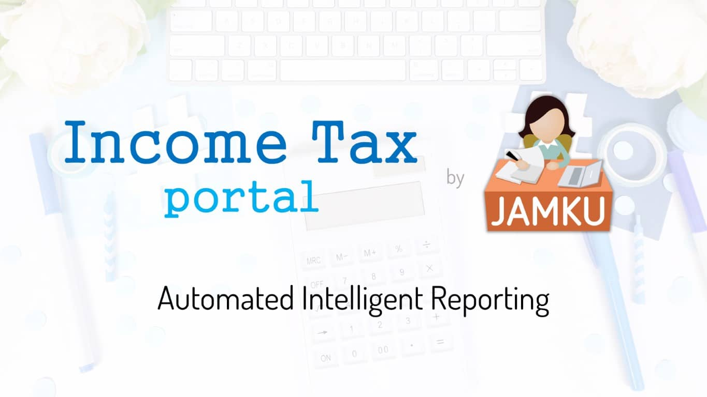

# Income Tax Portal by [Jamku](https://madrecha.com/jamku/)👩‍🦰

"[IT Portal by Jamku](https://itportal.jamku.app/)" is cloud software offered on [SAAS](https://en.wikipedia.org/wiki/Software_as_a_service) model. It's designed to be used by Chartered Accountants, Tax Consultants, Large corporates. Basically anyone who wants to view all the information about multiple PANs in one Unified Dashboard.

  

 

## Current Problems

1. No visibility on what is the Return Status after the IT Return is filed.
1. The Income Tax portal ([incometax.gov.in](https://www.incometax.gov.in/iec/foportal)) of Govt is ~some~ _most_ of the time slow
1. Notices are sent to Client and consultant is unware about the same
1. Login and navigating to the right page takes a lot of time. Some of the pages needs user to select Assesment Year and view information one by one.

## How it helps

1. Single unified dashboard for all PANs.
1. One click data fetching from Income tax portal for all PAN. Including all PDF files (i.e. Notices, Challans, Attachments).
1. Super simple and easy to use interface to track Demand, e-Proceeding, Return Status, Notices.
1. Inbuilt help on the Jargons used by income tax portal.
1. Provides list of actions to be taken.
1. Fast, intuitive search. All the reporting needs covered.

## Road Map
_Last updated on 26th July 2022_
* ✅11th June 2022 - 🐛 Beta Launch
* ✅25th June 2022 - 🦋 All information from Income tax portal
* ✅15th July 2022 - 🦋 [Get refund status from TIN NSDL](https://github.com/madrecha/itportal/issues/17)
* ✅20th July 2022 - 🔖 Tagging module to track Notices and Demands 
* 🟡10th Aug 2022 - 🚗 Get Information from Traces (TDS)
* 🟡TBD - ✈️ v3 TIS, AIS, 26AS download and analysis

## Screenshot 

## About Us

The software is brought to you by [Madrecha Solutions Pvt Ltd](https://www.linkedin.com/company/madrecha-and-company/), the company behind India's largest [practice management solution for CA, Tax Consultants](https://madrecha.com/jamku/), Jamku. More than 1700 CA, CPA, CS, Advocate firms trust Jamku to manage their practice. 
