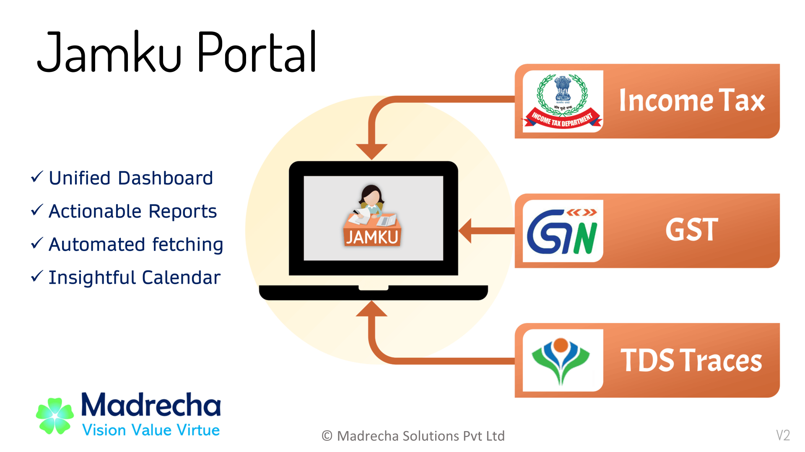

# Income Tax Portal by [Jamku](https://madrecha.com/jamku/)👩‍🦰

"[Jamku Portal](https://portal.jamku.app/)" is notice and compliance tracking software offered on [SAAS](https://en.wikipedia.org/wiki/Software_as_a_service) model. It's designed to be used by Chartered Accountants, Tax Consultants, Large corporates. Basically anyone who wants to view all the information about multiple entities (PAN/GSTIN/TAN) in one Unified Dashboard.

  

 

## Current Problems

1. No visibility on what is the Return Status after the IT Return is filed.
1. The Income Tax portal ([incometax.gov.in](https://www.incometax.gov.in/iec/foportal)) of Govt is ~some~ _most_ of the time slow
1. Notices are sent to Client and consultant is unware about the same
1. Login and navigating to the right page takes a lot of time. Some of the pages needs user to select Assesment Year and view information one by one.

## How it helps

1. Single unified dashboard for all PANs.
1. One click data fetching from Income tax portal for all PAN. Including all PDF files (i.e. Notices, Challans, Attachments).
1. Super simple and easy to use interface to track Demand, e-Proceeding, Return Status, Notices.
1. Inbuilt help on the Jargons used by income tax portal.
1. Provides list of actions to be taken.
1. Fast, intuitive search. All the reporting needs covered.

## Screenshot 

## About Us

The software is brought to you by [Madrecha Solutions Pvt Ltd](https://www.linkedin.com/company/madrecha-and-company/), the company behind India's largest [practice management solution for CA, Tax Consultants](https://madrecha.com/jamku/), Jamku. More than 1700 CA, CPA, CS, Advocate firms trust Jamku to manage their practice. 

## Offices / Enterprises Using Jamku IT Portal
This list was last updated on 16th August 2022. As of this date, more than 500 Offices have signed up for Jamku Portal.

* [Pola & Co _Vijayawada_](https://capola.co.in?jamkuRef=XCOBVR)
* [Girish D Maru & Associates _Mumbai_](https://girishdmaru.in?jamkuRef=6OJYMZ)
* [Veeresh And Ajay Chartered Accountant _Bangalore_](http://cavac.in/?jamkuRef=QIZWSM)
* [Rrpm & Associates Llp _Chennai_](http://rrpm.co.in?jamkuRef=LJ6CC6)
* [B Narsing Rao & Co _Hyderabad_](http://www.bnrandco.in/?jamkuRef=CR7Y7U)
* [V M B & Co _Mumbai_](http://www.cavmb.com?jamkuRef=4DGLD2)
* [A Narasimha Murthy And Co _Shivamogga_](https://anmcosmg.business.site/?jamkuRef=T8YKM2)
* [G Ravindra & Co _Bangalore_](https://gravindra.com/?jamkuRef=5ZXKGQ)
* [Sb Consultancy _Madurai_](https://sbconsultancy.net/?jamkuRef=8N3NHW)
* [Nakrani & Co. _Thane_](https://www.canp.co.in?jamkuRef=XJPXQ0)
* [Patade & Associates _Mumbai_](https://www.capna.in/?jamkuRef=FTBQEM)
* [Solutions Financial Consultancy _Kozhikode_](https://www.finpalbooks.com/?jamkuRef=QI5WXI)
* [Pentyala  Associates _Hyderabad_](https://www.pentyalaassociates.com?jamkuRef=4TJU90)
* [Phillipos And Co _Bangalore_](https://www.phillipos.co.in/?jamkuRef=9UVY0M)
* [J P Gosher & Co. _Mumbai_](https://jpgosher.in?jamkuRef=3RA5P8)
* [J. Vasania & Associates _Surat_](https://jvasania.com?jamkuRef=ZAOPOG)
* [Madrecha & Co _Thane_](https://madrecha.com?jamkuRef=7DBS6D)
* [P C Patil And Associates _Pune_](https://pcpatil.com?jamkuRef=DY5ICS)
* [Srga & Co. _New delhi_](https://srgglobal-ca.com?jamkuRef=AXSGNQ)
* [Prashanth Jain And Co _Panaji_](https://wwwcapkjaingoa.com?jamkuRef=GOE104)
* [Aakk & Associates _Calicut_](https://www.aakk.in?jamkuRef=GQPSWW)
* [Adms And Co _Delhi_](https://www.adms.co.in?jamkuRef=EHACVP)
* [Balaji Associates _Hyderabad_](https://www.balajiassociates.co.in?jamkuRef=1HSRSK)
* [Bharati And Co _Visakhapatnam_](https://www.bharatiandco.com?jamkuRef=PEWTH4)
* [B. P. Patil & Co _Haveri_](https://www.bppatil.com?jamkuRef=L9SB42)
* [D P Shewale And Co Llp _Pune_](https://www.cadpshewale.in?jamkuRef=3S3ELV)
* [Jkpp & Associates _Hyderabad_](https://www.cajkpp.com?jamkuRef=638AGB)
* [Chopda And Kataria _Bangalore_](https://www.chopdakataria.com?jamkuRef=AAM9VY)
* [Dhruvit Patel & Co. _Anand_](https://www.dhruvitpatel.com?jamkuRef=6YQ9WO)
* [Darshil I Nishar & Associates _Thane_](https://www.dinassociates.in?jamkuRef=6V5ZO4)
* [Ganesh Daivajna & Co _Goa_](https://www.gdco.in?jamkuRef=W90VJW)
* [Gvmd & Associates _Chennai_](https://www.gvmd.in?jamkuRef=F80BT8)
* [K Arun Kumar & Associates _Chennai_](https://www.kakassociates.net?jamkuRef=DLVP6T)
* [Kedar Kumbhojkar & Company _Kolhapur_](https://www.kedarkumbhojkar.com?jamkuRef=XXMIDA)
* [M S Kishore & Co _Hyderabad_](https://www.mskishoreandco.in?jamkuRef=RL8OHD)
* [Ncs And Co _Mangalore_](https://www.ncsco.in?jamkuRef=3Y745K)
* [Paul And Aravind Llp _Coimbatore_](https://www.paul-aravind.com?jamkuRef=L9PNU7)
* [P. Pujara And Co. _Wankaner_](https://www.ppujara.com?jamkuRef=6ND7G4)
* [Rama Subba Rao & Co _Visakhapatnam_](https://www.rsrca.com?jamkuRef=JDH0KX)
* [Sdba & Co _Mumbai_](https://www.sdba.co.in?jamkuRef=EZPS66)
* [Sachin Gujar & Associates _Pune_](https://www.sgujar.com?jamkuRef=VTUBDT)
* [Taxtreat _Mumbai_](https://www.taxtreat.in?jamkuRef=9AFD4N)
* [Umesh Agrawal And Associates _Khamgaon_](https://www.uaa.co.in?jamkuRef=XGVLW7)
* [V R U J & Associates _Rajkot_](https://www.vruj.in?jamkuRef=61LUN5)

